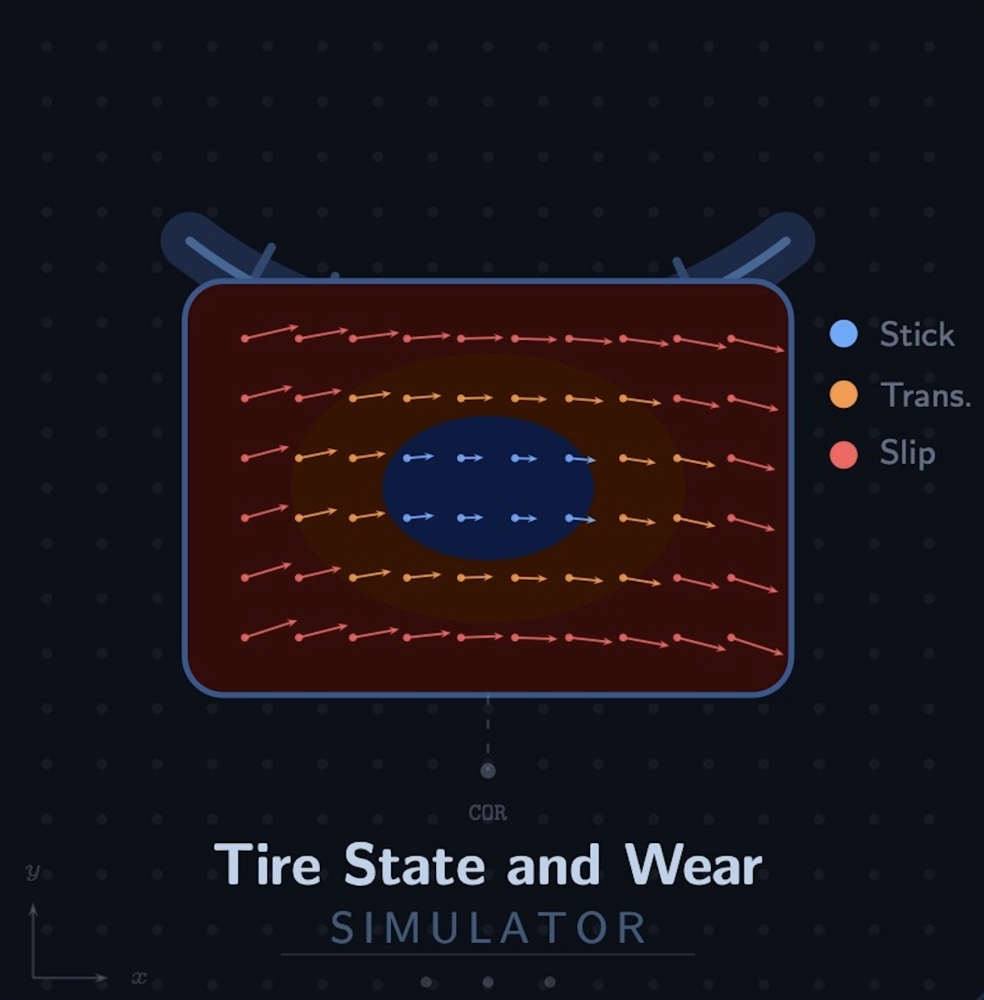
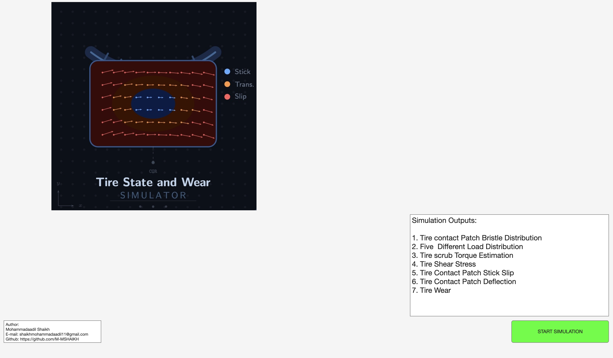
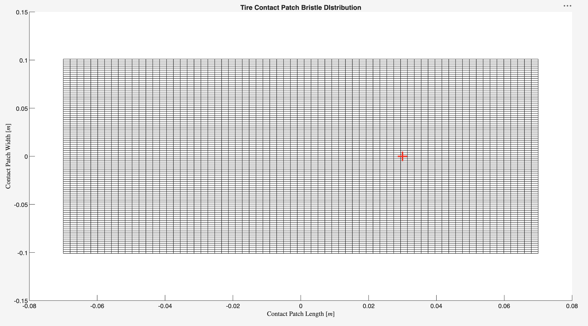
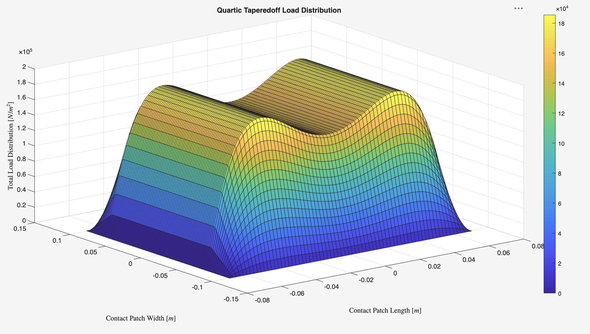
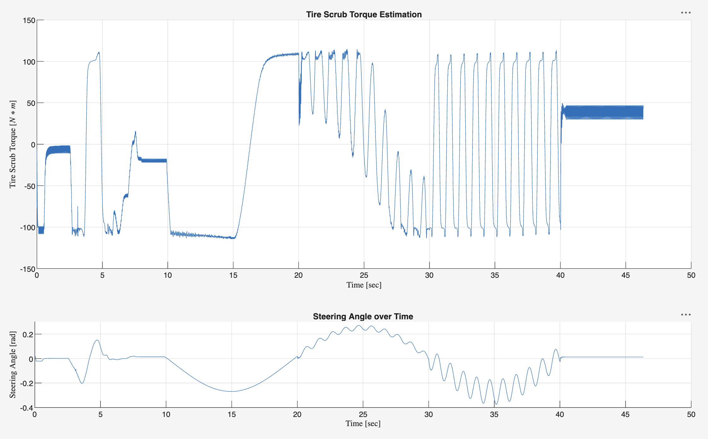
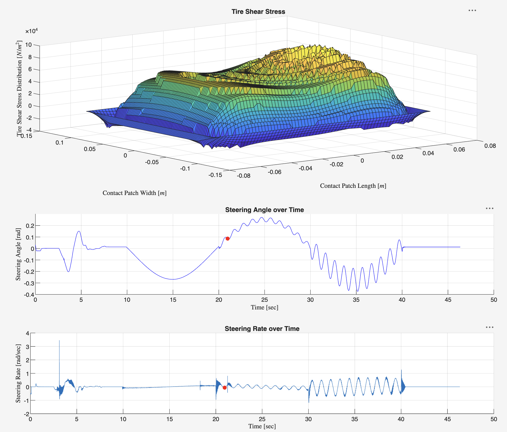
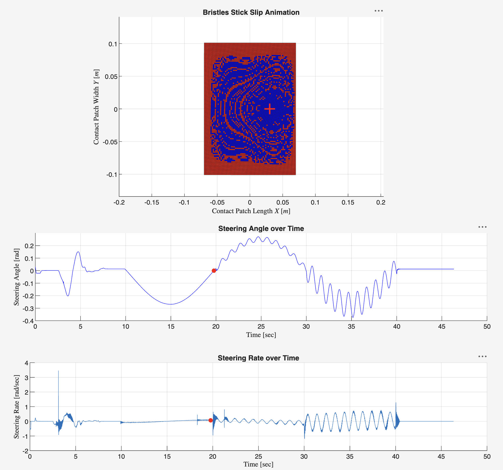
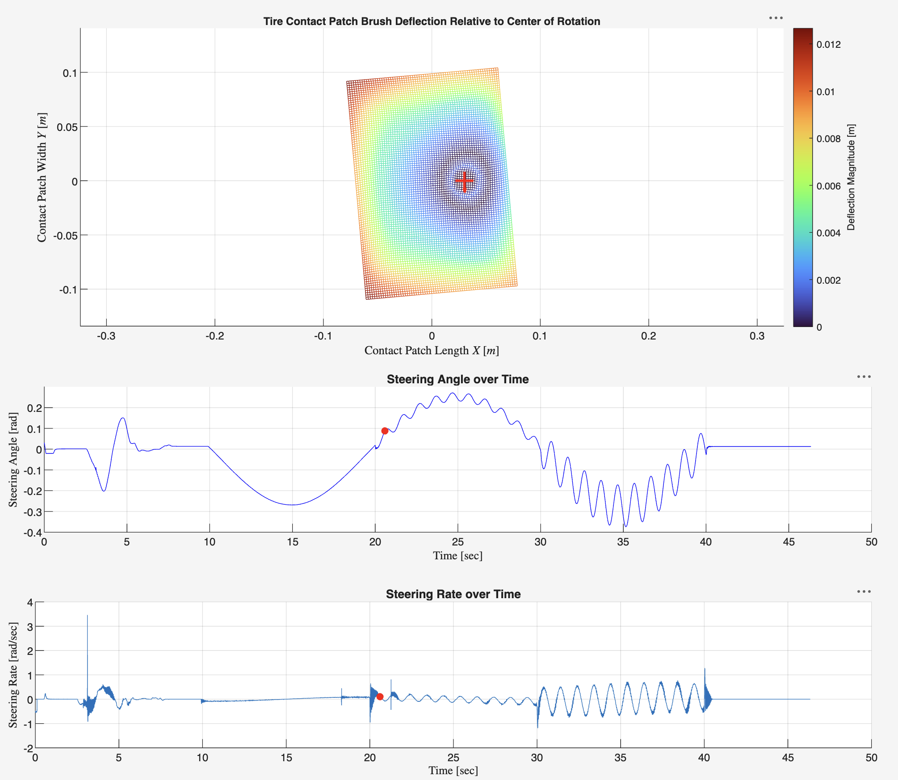
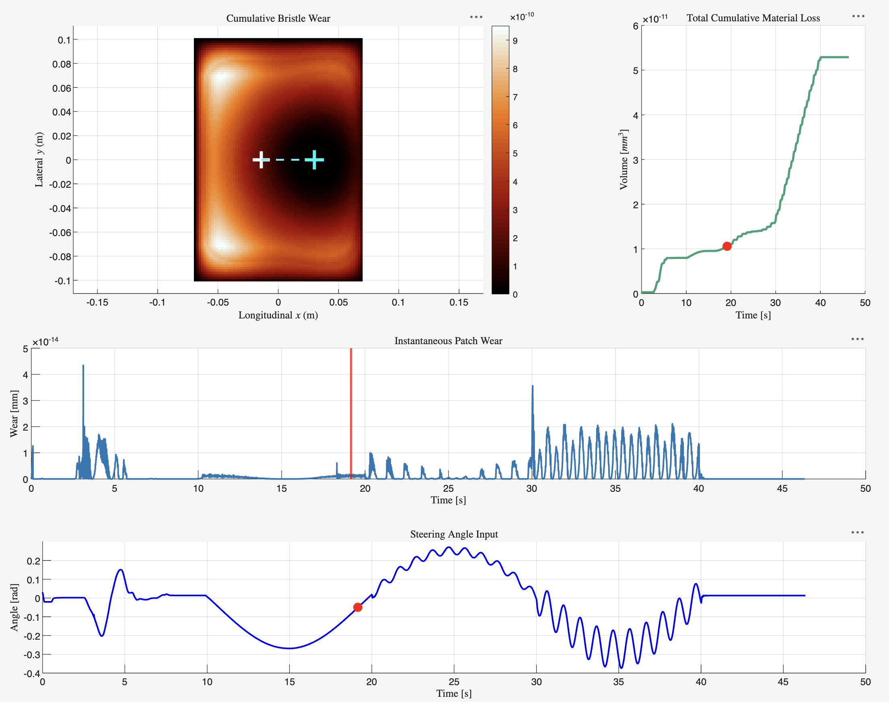

<p align="center">
  
</p>

<h1 align="center">TSW (Tire State and Wear) Simulator</h1>

<p align="center">
A micro-mechanical brush-model simulator for visualizing tire contact patch behavior — shear stress, stick-slip grip loss, and tread wear — under stationary steering maneuvers.
</p>

<p align="center">
  
  
</p>

[](https://uk.mathworks.com/matlabcentral/fileexchange/184108-tsw-simulator)

---

## Overview

Most vehicle models treat the tire as a single point of contact. TSWS zooms in instead — it models the actual **contact patch**, the small rubber footprint where the tire touches the road.

The simulator works on a **brush model**: imagine the tire tread as thousands of tiny flexible rubber bristles.

1. **Adhesion (Stick)** — bristles grip the road and bend elastically.
2. **Sliding (Slip)** — if the twisting force is too great, bristles break traction and scrape across the road.
3. **Wear** — the energy lost during scraping physically removes rubber from the tire.

TSWS simulates this entire chain — from bending, to slipping, to abrasive wear across thousands of individual bristles over time.

## Key Features

- 🧱 Configurable contact patch geometry and bristle grid resolution
- 📊 Five vertical load distribution models 
- 🔧 Tire scrub torque estimation from real steering data
- 🌡️ Animated shear stress visualization across the contact patch
- 🟦🟥 Stick-slip state animation (adhesion, sliding and transition zones)
- 🪶 Bristle deflection animation under steering load
- ⚙️ Tire wear prediction using an Archard wear model
- 📤 Exportable data at every stage for further analysis in MATLAB or Excel

## Demo

**Shear Stress Animation**


**Stick-Slip Animation**


<!-- **Tire Wear Animation**

 -->

## Workflow Walkthrough

TSWS is a linear, tab-by-tab workflow. Move through the tabs from left to right.

### Tab 1: Start

The landing page. It lists the seven outputs the simulator will generate, so you know what to expect before configuring anything.



### Tab 2: Bristle Distribution

Defines the physical size of the tire's contact patch and the resolution of the bristle grid. This is the geometric foundation every later tab builds on — smaller bristles give finer detail but take longer to compute.



### Tab 3: Load Distribution

Shows how the vertical load is spread across the footprint. Different distribution shapes mean grip isn't equal everywhere — usually the center of the patch carries more load than the edges.



### Tab 4: Tire Scrub Torque

Where your real steering data and friction coefficients come in. This tab calculates the torque the tire pushes back against the steering system — the core physical output of the brush model.



### Tab 5: Tire Shear Stress Animation

Animates how shear stress builds and migrates across the footprint as the steering wheel turns. High stress in a region means that part of the tire is approaching its friction limit.



### Tab 6: Bristles Stick-Slip Animation

Shows exactly which bristles are gripping (stick) and which are sliding (slip) at any given instant. This reveals the spatial pattern of grip loss inside the contact patch, rather than just a single overall number.



### Tab 7: Bristles Deflection Animation

Visualizes the physical bending of each bristle as it twists under steering — the elastic deformation underlying the stress and torque numbers.



### Tab 8: Tire Wear Animation

Converts the sliding energy calculated in earlier tabs into material loss, showing where the tire wears fastest and how much tread depth is lost over the maneuver.



## Requirements & Installation

- **MATLAB R2022a or later**
- App Designer
- *(Matlab Symbolic Toolbox)*

**To run:**

```bash
git clone https://github.com/M-MSHAIKH/TSW-Simulator.git
```

1. Navigate to the cloned `TSWS` directory.
2. Unzip the `tsw_simulator_Toolbox` under matlab folder.
3. Open Matlab 2022a or newer and direct current Matalb directory to release folder under tsw_simulator_Toolbox folder.
3. Open the app file (tsw_simulator.mltbx) in matlab and click.
4. This will create an app under my app in APPs section.

## Input Data Format

TSWS needs steering input over time to calculate how the tire twists.

- **File format:** MATLAB data file (`.mat`)
- **Required variables:**
  1. Steering angle, in radians
  2. Time, in seconds
- **Default names:** `steering_angle` and `time_sec`. If your variables are named differently, you can type the exact names via matlab before loading.
- **Sampling:** Data must be uniformly sampled and of equal length. If it isn't, interpolate it first.

## Example Dataset

An example dataset, `tsws_example_data.mat`, is included. It contains real steering maneuver data from the **P1 Garage research vehicle at Bucknell University**, pre-mapped to the variable names TSWS expects ready to load and run immediately.

## Documentation

This README covers the basics. For more detail, see:

- 📘 **[Full User Guide (PDF)](docs/TSWS_User_Guide.pdf)** — step-by-step instructions for every input parameter, plus the full exportable variable reference.

## Assumptions & Limitations

- **No thermal dynamics** — friction coefficients are assumed constant; heat-driven friction changes from aggressive sliding aren't modeled.
- **Stationary steering** — the vehicle is assumed parked, with only the steering wheel rotating left and right.
- **Flat road surface** — no roll steer, camber thrust, or uneven terrain effects.
- **Abrasive wear only** — calculates frictional wear; doesn't model structural failures like chunking or tearing.

## License

This project is licensed under **CC BY-NC-ND 4.0** — you may share this work with attribution, but **not for commercial purposes** and **not in modified form**.

See [`LICENSE`](LICENSE) for full terms.
